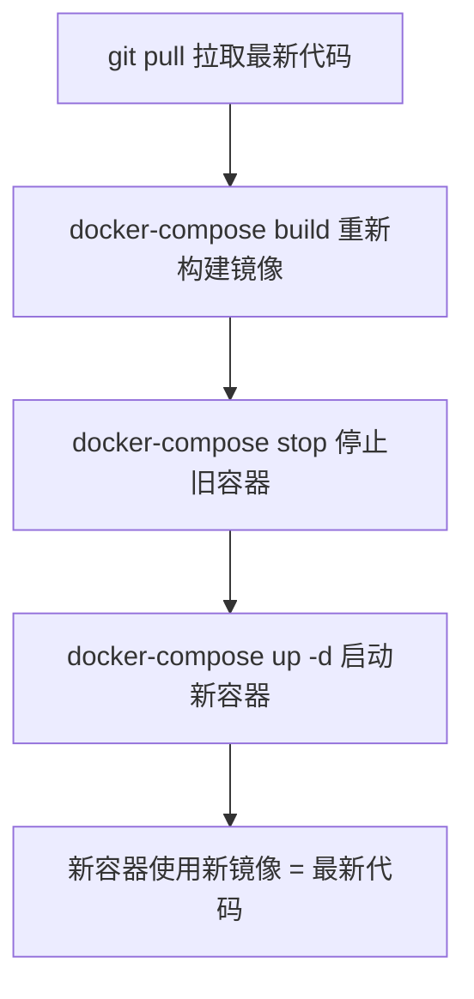

# Celery Worker 代码更新问题解决方案

## 🔍 问题描述

### 现象
执行 `update_celery_external_db.sh` 脚本后，Celery Worker 重启了，但是仍然报错：

```
TypeError: split_into_chunks() got an unexpected keyword argument 'mode'
```

### 原因分析

**问题根源**: Docker 容器内的代码没有更新

1. `git pull` 只更新了**主机上的代码**
2. **Docker 容器是基于镜像运行的**
3. 镜像中的代码是**构建时的版本**
4. 仅重启容器 (`docker-compose restart`) **不会更新镜像中的代码**

```
┌─────────────────────────────────────────┐
│  主机代码目录 (已更新)                  │
│  ├── backend/app/utils/document_parser.py  ← git pull 更新了这里
│  └── ...                                   │
└─────────────────────────────────────────┘
                ↓ (不会自动同步)
┌─────────────────────────────────────────┐
│  Docker 镜像 (构建时的旧代码)           │
│  ├── /app/backend/app/utils/document_parser.py  ← 还是旧版本
│  └── ...                                   │
└─────────────────────────────────────────┘
                ↓ (基于镜像运行)
┌─────────────────────────────────────────┐
│  Docker 容器 (运行中)                   │
│  └── Celery Worker (使用镜像中的旧代码) │
└─────────────────────────────────────────┘
```

---

## ✅ 解决方案

### 方案1: 使用更新后的脚本（推荐）

在远程服务器上执行：

```bash
cd /path/to/CodeHubot

# 1. 拉取最新代码和脚本
git pull origin main

# 2. 执行更新脚本（已包含镜像重新构建）
./update_celery_external_db.sh
```

**脚本会自动执行**:
1. ✅ `git pull` - 拉取最新代码
2. ✅ `docker-compose build --no-cache celery_worker` - 重新构建镜像
3. ✅ `docker-compose stop celery_worker` - 停止旧容器
4. ✅ `docker-compose up -d celery_worker` - 启动新容器

---

### 方案2: 手动执行（如果脚本有问题）

```bash
cd /path/to/CodeHubot

# 1. 拉取最新代码
git pull origin main

# 2. 重新构建 Celery Worker 镜像（包含最新代码）
docker-compose -f docker/docker-compose.external-db.yml build --no-cache celery_worker

# 3. 停止旧容器
docker-compose -f docker/docker-compose.external-db.yml stop celery_worker

# 4. 启动新容器（使用新镜像）
docker-compose -f docker/docker-compose.external-db.yml up -d celery_worker

# 5. 查看日志验证
docker-compose -f docker/docker-compose.external-db.yml logs -f celery_worker
```

---

## 📊 正确的更新流程

### Docker 服务代码更新流程



### 为什么需要 `build`？

| 操作 | 作用 | 代码更新 |
|------|------|---------|
| `git pull` | 更新主机代码 | ✅ 主机代码最新 |
| `docker-compose restart` | 重启容器 | ❌ 容器内代码不变 |
| `docker-compose build` | 重新构建镜像 | ✅ 镜像包含最新代码 |
| `docker-compose up -d` | 使用新镜像启动容器 | ✅ 容器内代码最新 |

---

## 🔧 验证修复

### 1. 检查服务状态

```bash
docker-compose -f docker/docker-compose.external-db.yml ps celery_worker
```

**期望输出**: 状态为 `Up`

### 2. 查看日志

```bash
docker-compose -f docker/docker-compose.external-db.yml logs --tail=50 celery_worker
```

**期望看到**:
```
[INFO] celery@xxx ready.
```

**不再看到**:
```
TypeError: split_into_chunks() got an unexpected keyword argument 'mode'
```

### 3. 测试文档上传

1. 访问知识库详情页
2. 上传一个 Markdown 文档
3. 观察是否成功向量化

**期望日志**:
```
[INFO] 成功使用 UTF-8 编码解析 Markdown 文件
[INFO] [步骤1/4] 文档 X 切分完成: Y 个文本块
[INFO] ✅ 文档 X 向量化完成
```

---

## 📝 脚本对比

### 旧版脚本（有问题）

```bash
git pull origin main
docker-compose restart celery_worker  # ❌ 只重启，代码不更新
```

### 新版脚本（已修复）

```bash
git pull origin main
docker-compose build --no-cache celery_worker  # ✅ 重新构建镜像
docker-compose stop celery_worker              # ✅ 停止旧容器
docker-compose up -d celery_worker             # ✅ 启动新容器
```

---

## 🎯 关键要点

### 1. Docker 容器代码更新规则

- ❌ **错误认识**: `git pull` 后重启容器就能更新代码
- ✅ **正确做法**: `git pull` → `build` → `stop` → `up -d`

### 2. 为什么加 `--no-cache`？

```bash
docker-compose build --no-cache celery_worker
```

- 不使用 Docker 构建缓存
- 确保完全重新构建
- 避免缓存导致的旧代码残留

### 3. 其他服务也一样

此问题适用于所有 Docker 服务：
- ✅ **Backend**: `update_frontend_backend_external_db.sh` 已包含 `build`
- ✅ **Frontend**: `update_frontend_external_db.sh` 已包含 `build`
- ✅ **Celery Worker**: `update_celery_external_db.sh` 现已包含 `build`

---

## 🚀 快速命令参考

### 常用命令

```bash
# 查看所有服务状态
docker-compose -f docker/docker-compose.external-db.yml ps

# 查看 Celery Worker 日志
docker-compose -f docker/docker-compose.external-db.yml logs -f celery_worker

# 重启所有服务（不更新代码）
docker-compose -f docker/docker-compose.external-db.yml restart

# 重新构建并启动所有服务（更新代码）
docker-compose -f docker/docker-compose.external-db.yml build --no-cache
docker-compose -f docker/docker-compose.external-db.yml up -d
```

### 更新脚本

```bash
# 仅更新前端
./update_frontend_external_db.sh

# 更新前端+后端
./update_frontend_backend_external_db.sh

# 更新 Celery Worker
./update_celery_external_db.sh
```

---

## ✅ 总结

### 问题
- Celery Worker 重启后代码没更新

### 原因
- Docker 容器基于镜像运行
- 镜像中的代码是构建时的版本
- 仅重启容器不会更新代码

### 解决
- 添加 `docker-compose build` 步骤
- 重新构建镜像包含最新代码
- 启动新容器使用新镜像

### 现状
- ✅ 脚本已修复并推送到远程
- ✅ 可以拉取最新脚本使用
- ✅ 问题已彻底解决

---

**更新时间**: 2024-12-29  
**Commit**: `b0a62f9`

